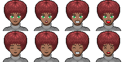
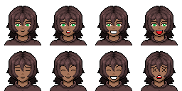
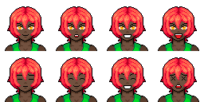
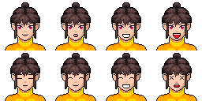
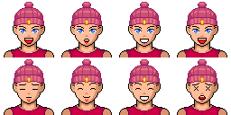
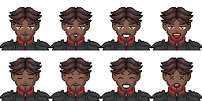
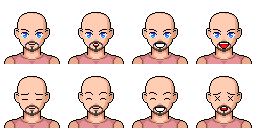
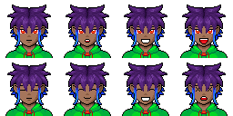
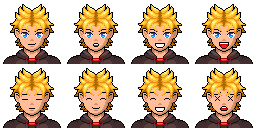

# Character Notes

Working notes for the playable / NPC character sprites. Each entry lists the
asset folder, the base sprite file, the character name, and a short description.

---

## Female Characters

### Character 01 — `female/01/Character_001.png`

- **Hazel** — auburn bob, green eyes, grey high collar. Poised.

### Character 02 — `female/02/Character_002.png`

- **Mira** — brown hair, green eyes, brown shirt. **Possible main.**

### Character 04 — `female/04/Character_004.png`

- **Cleo** — fiery red hair, orange eyes, green top. Bold.

### Character 05 — `female/05/Character_005.png`

- **Suki** — brown top-knot, pink eyes, yellow turtleneck. Cheerful.

---

## Male Characters

### Character 09 — `male/09/Character_009.png`

- **Bren** — red beanie, blue eyes, red shirt.

### Character 10 — `male/10/Character_010.png`

- **Garrick** — armored, brown eyes, platemail.

### Character 11 — `male/11/Character_011.png`

- **Otto** — bald, blue eyes, pink shirt.

### Character 13 — `male/13/Character_013.png`

- **Ash** — purple/blue hair, red eyes, green shirt. **Possible main.**

### Character 14 — `male/14/Character_014.png`

- **Finn** — blonde hair, blue eyes, brown shirt. **Possible main.**
